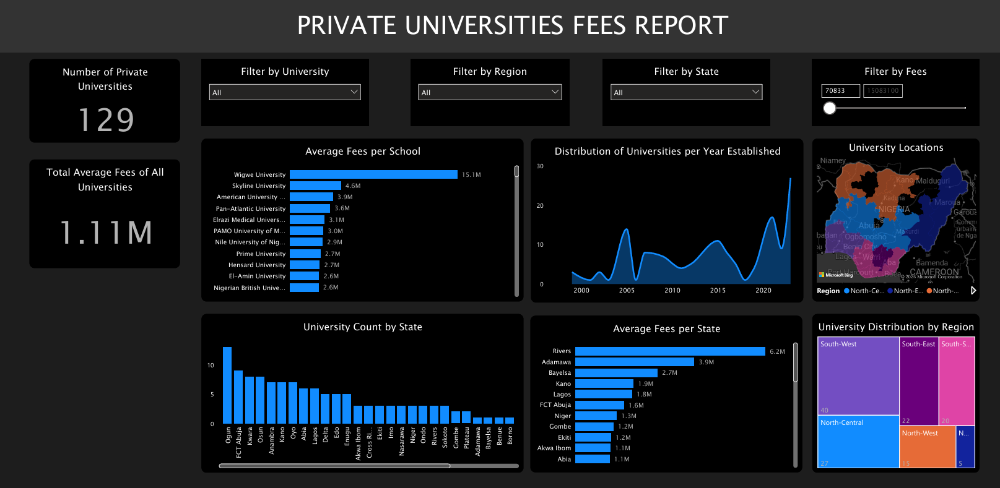

# Private Universities Data Analysis

## Overview

This project aims to analyze the landscape of Nigerian universities by collecting and cleaning data, performing exploratory data analysis (EDA), and creating insightful visualizations using Power BI. The primary goal is to provide a comprehensive understanding of the higher education sector in Nigeria.

## Table of Contents

- [Project Overview](#overview)
- [Dataset](#dataset)
- [Data Cleaning](#data-cleaning)
- [Exploratory Data Analysis](#exploratory-data-analysis)
- [Dashboard](#dashboard)
- [Installation](#installation)
- [Usage](#usage)
- [Contributing](#contributing)
- [License](#license)

## Dataset

The dataset used in this project includes information on universities in Nigeria, such as:

- University Name
- Website
- Year Established
- Fees
- State
- Region

## Installation

1. Clone the repository:

   ```
    git clone https://github.com/poshlovesdata/PrivateUniversitiesAnalysis
   ```

2. Navigate to the project directory:

   ```
    cd privateuniversitiesanalysis
   ```

3. Install the required Python packages:

   ```
    pip install pandas
   ```

## Usage

1. Open the Jupyter Notebook file to see the data cleaning and EDA process
   jupyter notebook private_uni.ipynb

2. View the Power BI dashboard by opening the dashboard.pbix file in Power BI Desktop.

## Dashboard



## Contributing

Contributions are welcome! Please feel free to submit a Pull Request.
License
This project is licensed under the MIT License. See the LICENSE file for details.
